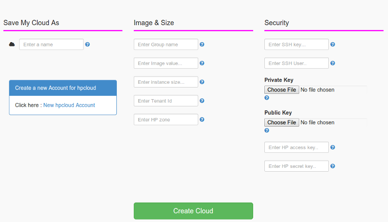
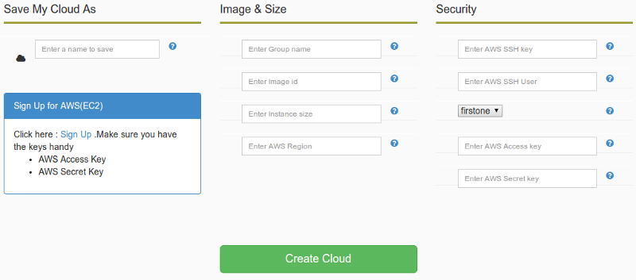
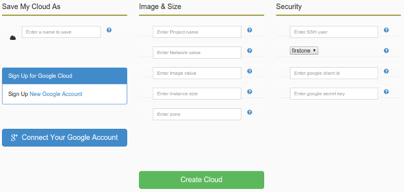
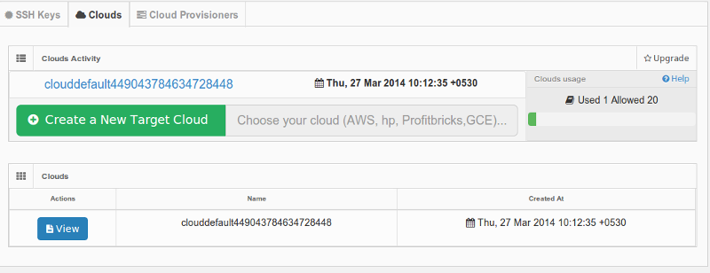
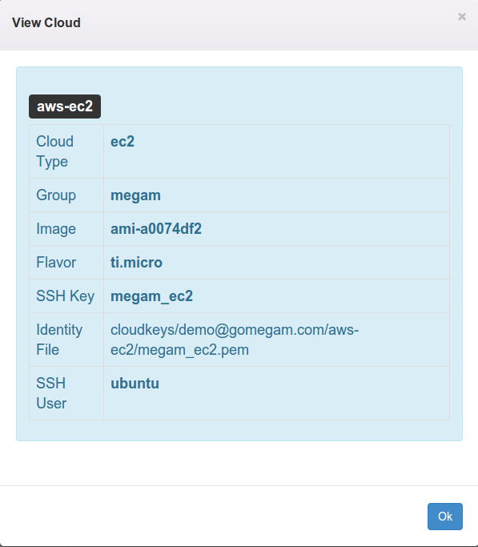

#####################
Cloud
#####################

This option allows you setup multi cloud definitions.::

   1. Helpful when you run your apps/services with different memory/cpu and storage. 

   2. Helpful when you want to quickly launch the same app/service in a different cloud.

We have provided you with one cloud default to play with.  

.. hint:: The supported clouds are:

+------------------------+----------------------------------------------------------------------+
| Cloud                  | Description                                                          |
|                        |                                                                      |
+========================+======================================================================+
| hp (openstack)         | `hpcloud.com <https://console.hpcloud.com>`_.                        |
|                        | supported, tested with ubuntu images                                 |
+------------------------+----------------------------------------------------------------------+
| AWS                    | `AWS EC2 <https://console.aws.amazon.com/console/homem>`_.           |
|                        | supported, tested with ubuntu images                                 |
+------------------------+----------------------------------------------------------------------+
| Google cloud           | `google cloud <https://cloud.google.com/>`_.                         |
|                        | supported, tested with debian images                                 |
+------------------------+----------------------------------------------------------------------+
| Artisan                | `artisaninfrastructure.com <http://www.artisaninfrastructure.com>`_. |
|                        | work in progress                                                     |
+------------------------+----------------------------------------------------------------------+
| Podnix Cloud           | `podnix.com <https://www.podnix.com>`_.                              |
|                        | work in progress                                                     |
+------------------------+----------------------------------------------------------------------+
| Profit bricks          | `profitbricks.com <https://www.profitbricks.com>`_.                  |
|                        | work in progress                                                     |
+------------------------+----------------------------------------------------------------------+

HP
============================

If you have your own account with hp, you can use the same with megam. 

1. Have the configuration handy as per this link `hp <https://community.hpcloud.com/article/getting-started-compute-135>`_.

2. Click ``Settings`` and choose ``hp`` icon. 
   

          
3. Click Save
   
4. You can see your saved settings in under ``Manage Settings`` >  ``Clouds``   
 

Podnix Cloud
============================

.. hint:: Under testing. Work in progress.

Profit Bricks
============================

.. hint:: Under testing. Work in progress.

Artisan
============================

.. hint:: Work in progress.

AWS
============================

If you have your own account with AWS, you can use the same with megam. 

1. Have the configuration handy as per this link `AWS EC2 <http://docs.aws.amazon.com/AWSEC2/latest/UserGuide/ec2-launch-instance_linux.html>`_.

2. Click ``Settings`` and choose ``AWS`` icon. 
   

 
3. Click Save
   
4. You can see your saved settings in under ``Manage Settings`` >  ``Clouds``   
 

GCE
============================

If you have your own account with AWS, you can use the same with megam. 

1. Have the configuration handy as per this link `GCE <https://developers.google.com/compute/docs/instances#start_vm>`_.

2. Click ``Settings`` and choose ``GCE`` icon. 
   

         
3. Click Save

4. You can see your saved settings in under ``Manage Settings`` >  ``Clouds``   
 
Manage
============================

Once the cloud setting was saved, to manage them.   Click ``Settings`` from Dashboard.

 		
 		   
**View**  		
 		
Click ``Clouds`` on the tab view
             
Select and View the cloud          

