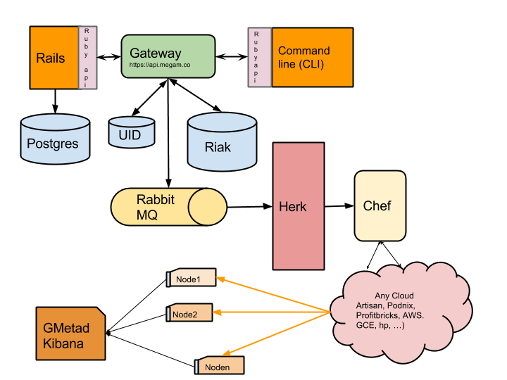
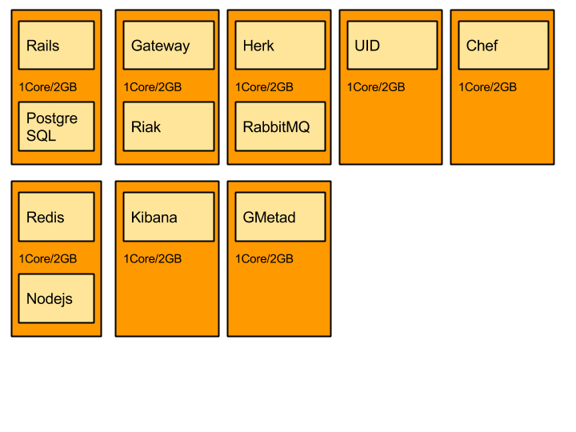

#############################
How Megam Works 
#############################

Overview
--------

**Logical**

This a logical overview of how megam pieces connect. 

**Components**

The description of the various components as seen in the logical architecture. 

   +------------------------+------------------------------------------------------------------------------------------------------------+
   | Name in (pic)          | Description                                                                                                |
   |                        |                                                                                                            |
   +========================+============================================================================================================+
   | 1.Rails & PostgreSQL   | This is a user interface for megam. A portal built using `Ruby on Rails <http://rubyonrails.org/>`_.       | 
   |                        | which is the browser based client for Megam.                                                               |
   |                        | Project source code:`github.com/indykish/nilavu.git <https://github.com/indykish/nilavu.git>`_.            |            
   |                        | This currently runs at `www.megam.co <https://www.megam.co>`_.                                             |
   +------------------------+------------------------------------------------------------------------------------------------------------+
   | 2.Gateway & RiaK)      | Gateway is a `Playframework(scala) <http://wwww.playframework.com/>`_  based RESTful API server.           |
   |                        | We have limited API support during the beta. which is the browser based client for Megam.                  |
   |                        | Project source code:`github.com/indykish/megam_play.git <https://github.com/indykish/megam_play.git>`_.    |            
   |                        | API docs: `api.megam.co <https://api.megam.co>`_.                                                          |                                                  
   |                        | Riak is a NOSQL datastore used by the Gateway.                                                             |      
   +------------------------+------------------------------------------------------------------------------------------------------------+
   | 3.UID                  | UID is a JVM based network service for generating unique ID numbers at high scale with some                |
   |                        | simple guarantees. This is a fork of twitter's snowflake project by adding a scala client to it.           |
   |                        | Project source code:`github.com/indykish/snowflake.git <https://github.com/indykish/snowflake.git>`_.      |            
   +------------------------+------------------------------------------------------------------------------------------------------------+
   | 4.Herk & RabbitMQ      | Herk is a `Akka(scala) <http://akka.io/>`_ based clustered cloud bridge that spins several masters/workers |                                 
   |                        | to service the requests submitted.                                                                         |
   |                        | Project source code:`github.com/indykish/megam_akka.git <https://github.com/indykish/megam_akka.git>`_.    |            
   |                        | RabbitMQ is an AMQP based  messaging system which serves as a hub for all the interconnecting systems      |
   +------------------------+------------------------------------------------------------------------------------------------------------+
   | 5.Chef                 | Chef to create a code-based model for your infrastructure.                                                 |
   |                        | Currently we support both Enterprices Chef (managed by opscode), and opensource Chef                       |   
   |                        | Project source code:`github.com/indykish/chef-repo.git <https://github.com/indykish/chef-repo.git>`_.      |            
   |                        | Project source code contains the currently curated cookbooks.                                              | 
   +------------------------+------------------------------------------------------------------------------------------------------------+
   | 6.Redis & Node.js      | Redis is an open source, BSD licensed, advanced key-value store. This is where all the logs are streamed   |
   |                        | Node.js is a javascript server runtime, used to serve the browser on any real time log.                    |
   |                        | This acts like command `tail -100 cloud.log`                                                               |
   |                        | Project source code:`github.com/indykish/tap.git <https://github.com/indykish/tap.git>`_.                  |            
   +------------------------+------------------------------------------------------------------------------------------------------------+
   | 7.Kibana               | Offline logs, log analytic engine (elastic-server) helps to view/archive analyze logs                      |
   |                        | which is the browser based client for Megam.                                                               |
   |                        | Project source code:`kibana <http://www.elasticsearch.org/overview/kibana/>`_.                             |            
   |                        | `www.megam.co <https://www.megam.co>`_.                                                                    |
   +------------------------+------------------------------------------------------------------------------------------------------------+
   | 8.GMetad               | Ganglia metrics montoring server that collects and stores all the rrds files                               |
   |                        | of the VMs running. Though more metrics can be seen, the portal only displays (load on cpu and number of   |
   |                        | http requests)                                                                                             |            
   |                        | `www.megam.co <https://www.megam.co>`_.                                                                    |
   +------------------------+------------------------------------------------------------------------------------------------------------+

**Deployment**

Then full stack of software as

For more detail technical know how, here is the reference. 

* Flatcloud - slideshare: `http://slidesha.re/1h8k9tt <http://slidesha.re/1h8k9tt>`_

