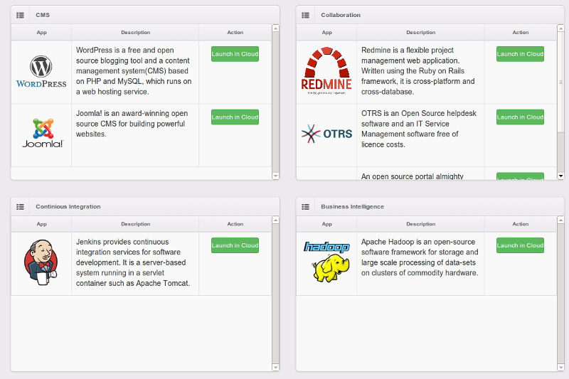
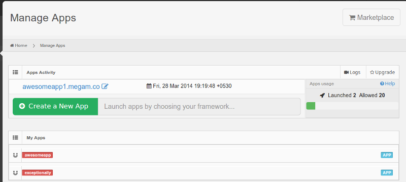

#####################
Marketplace
#####################

This allows you to consume pre built application and services from 3rd party in a single click.


Launch
========

Click on ``Marketplace`` from the top right corner of the ```Dashboard``




Wordpress
============================

From the marketplace, click the ``Launch`` button in Wordpress under `CMS` category. 

   1. This takes you to the `Apps Step 2 of 2`. 

   2. Click ``Launch`` again

   3. Wordpress has been launched in the URL shown to you. 
  
Manage the marketplace just like any other  ``app``.

Manage
============================

Once the app is launched, to manage them.   Click ``My Apps`` from Dashboard.


 		
 		   
**Delete**  		
 		
 Click ``your app name`` under ``My Apps``
             
 Click Delete         
  
