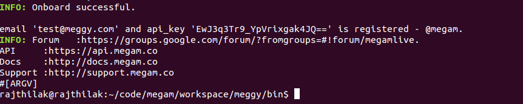

.. Megam Cloud documentation master file, created by
   sphinx-quickstart on Mon Nov 11 10:32:52 2013.
   You can adapt this file completely to your liking, but it should at least
   contain the root `toctree` directive.

#############################
Quick Start
#############################

The command line uses Ruby 2.0 + to interact with Megam Cloud. 

**Verbose Mode**
  This a beta launch, and we have enabled verbose mode for the CLI. We'll add more features rapidly post our launch.

* To install the Ruby-based Megam client tools, you first need to install git and Ruby Gems.

On a Debian-based Linux distribution, it’s as easy as:
`$> sudo apt-get install ruby rubygems`

On a rpm-based Linux distribution, it’s as easy as:
`$> sudo yum install ruby rubygems`

`Next, install the Megam Cloud (meggy) gem:`
$> gem install meggy

Develop an App on Cloud
============================

We now discuss how to create your own pyre project by reviewing typical pyre project structre and some useful Make.mm directives.

.. _pyre-directory-structure:

Pyre project structure
----------------------

A pyre project typically contains a number of directories.  For example, supposing one creates a pyre project with <package> as it's name:

* applications/

  Pyre applications typically are put in this directory with a :ref:`Make.mm <make-mm>` that exports them to the pythia-0.8/bin directory.  :ref:`Pyre convention <pyre-style>` appends a "d" to the app name if it is a service daemon.  

* etc/

  This directory stores facility factory method files, called :ref:`odb files <odb-files>`, for switching facilities at run time.  The internal structure of etc/ mirrors the structure of the application and its components.  For example suppose the application is called MdApp with the inventory::

    class MdApp(Script):
    
        class Inventory(Script.Inventory):
            import pyre.inventory as inv 
            mdEngine = inv.facility('mdEngine', default='gulp')
            mdEngine.meta['known_plugins'] = ['gulp','mmtk','lammps','cp2k']
            mdEngine.meta['tip'] = 'which md engine to use'

  Then etc/ would have the structure::

    $ ls etc
    Make.mm MdApp
    $ ls etc/MdApp
    gulp.odb mmtk.odb lammps.odb cp2k.odb
    
* <package>/

  This is the top level directory for python source.

* lib<package>/

  This contains possible c extensions.

* <package>module/

  This contains python bindings to the c extensions.

* tests/

  Tests for all parts of the project.

Although this directory structure is not mandatory, it is somewhat conventional.  Much of this structure can be generated automatically by using the :ref:`package utility<create-a-pyre-project>`. 

When creating one's own pyre project, one must learn some internals of the Make.mm build system.  Here we overview some of them.  The rest may be learned by reading config files such as .

Directives/options/macros used in Make.mm
-----------------------------------------

Make.mm format is similar to that of typical linux shell scripting.  A few macros which may be useful are:

 * export-python-package 

 * others to be included

While coding the new pyre project, one may also need to debug.  Pyre's native debugger is called journal.

.. _journal:

Journal
-------

Pyre's native debugger is called journal.
It allows developers to insert journalling instructions in their code that produce
pyre application diagnostics such as
error reporting, warnings, and debugging.

To create a journal channel and write to it include something like the following::

  >>> import journal
  >>> debug = journal.debug('myproject')
  >>> debug.activate()
  >>> debug.log( 'This is a debugging message' )

which gives the output::

   >> <stdin>:1:<module>
   >> myproject(debug)
   -- This is a debugging message
  <journal.diagnostics.Diagnostic.Diagnostic object at 0x956910>

The factory ::

  journal.debug

creates journal channels of "debug" type. And this call::

  journal.debug("myproject")

creates a journal debug channel named "myproject".
The call::

  >>> debug.activate()

activates this channel.
And now you are ready to output to the newly created journal stream::

  >>> debug.log( 'This is a debugging message' )

Journal types
^^^^^^^^^^^^^
Following types are available
 * debug: debugging information. Default off.
 * error: unrecoverable runtime error. Default on.
 * firewall: fatal programming error. Default on.
 * info: descriptive information. Default off.
 * warning: recoverable runtime error. Default off.

Journal devices
^^^^^^^^^^^^^^^

Journals can be easily directed to different devices. By default, journal
writes to a terminal-like device that directly outputs to screen.
Another very useful device is a journal daemon.

Journal daemon
""""""""""""""
.. It is also a good model of a pyre application as discussed in :ref:`a section on advanced pyre <journal-structure>`.  

Because journal is a daemon, it produces debugging info for all application types, whether distributed or local.

To start using journal daemon, first execute the journal daemon by typing::

    $ journald.py	

from the command line.  (also talk about having the right pml files set up and making sure journal is "pointing" to them).  Then insert the following at the top of your pyre app::

    import journal
    journal.info(name).activate()
    journal.debug("journal").activate()

Then in the constructor, information about the code part may be labeled in order to discern which, of the many parts of your code, is outputting the information::

    i = journal.info(codepart)
    d = journal.debug(codepart)

and as the need arises, insert debugging statements in your code::

    i.log(something-you'd-like-to-see)
    d.log(something-you'd-like-to-see)

Journaling for pyre components
^^^^^^^^^^^^^^^^^^^^^^^^^^^^^^

Journaling channels are automatically set up for all pyre components.
In Configurable.py, a superclass of Component.py::

    def __init__(self, name):
	...
        self._info = journal.info(name)
        self._debug = journal.debug(name)

so that if one desires to debug pyre components or pyre scripts, one only has to call::

    self._debug.log(something-you'd-like-to-see)

and make sure they turn "on" debug or info output for that component.  For example, this can be done with a journal.pml file in one's config directory::

.. _debugger:

Other debuggers
---------------

In addition to journal, and especially for routine debugging of individual components, interactive debuggers (such as in Eclipse) may be useful.  Pyre is particularly amenable to this type of testing since all parameters may be input via the commandline, which in Eclipse may be stored as run configurations.  

In Eclipse these run configuration can also be exported ("Shared File" under the "Common" tab) and archived or shared among developers.  Additionally, each time a developer changes the run configuration, Eclipse automatically updates the exported files.

Create your app
---------------

Once you have created your directory structure and learned how to use a debugger, you are ready to go!  Just type 'mm' to install your resulting code into the pyre installation directory and it should be available on your python path.

::

    {'caption': False,
     'codeend': '',
     'codestart': '',
     'content': '\nfrom pylab import *\nimport scipy.signal as signal\n#A funct
    ion to plot frequency and phase response\ndef mfreqz(b,a=1):\n    w,h = sig
    nal.freqz(b,a)\n    h = abs(h)\n    return(w/max(w), h)\n\n',
     'doctype': 'html',
     'echo': True,
     'evaluate': True,
     'extension': 'html',
     'f_pos': 'htpb',
     'fig': False,
     'figfmt': '.png',
     'include': True,
     'name': None,
     'number': 1,
     'outputend': '',
     'outputstart': '',
     'result': '\n\n',
     'results': 'verbatim',
     'savedformats': ['.png'],
     'term': False,
     'termend': '',
     'termstart': '',
     'type': 'code',
     'width': '600',
     'wrap': True}
    
    

.. note:: 

  Pweb class also uses separate classes to parse and execute
  the document, but subclassing these is not currently documented and
  is hopefully not needed.

**Coming soon**
  Email us at nkishore@megam.co.in

