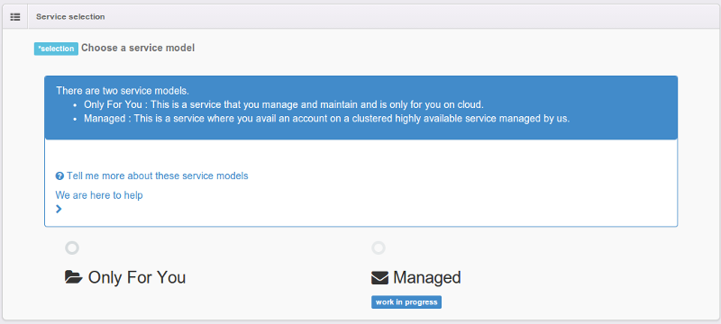

#####################
Services
#####################

Developing apps using a service is easy with megam.:

   1. You have your app ready to integrate with a Service. 
  
   2. The services supported are PostgreSQL, Redis, Riak
   
   +------------------------+-----------------------------------------------------------------------+
   | Service                | Description                                                           |
   |                        |                                                                       |
   +========================+=======================================================================+
   | PostgreSQL             | `www.postgresql.org <http://www.postgresql.org>`_.                    |
   |	                    | PostgreSQL is a powerful, open source object-relational database      |
   |                        | has more than 15 years of active development and a proven             | 
   |                        | architecture that has earned it a strong reputation for reliability,  | 
   |                        | data integrity, and correctness. It runs on all major operating       |     
   |                        | systems, including Linux, UNIX (AIX, BSD, HP-UX, SGI IRIX, Mac OS X,  | 
   |                        | Solaris, Tru64), and Windows.                                         | 
   |                        | It is fully ACID compliant, has full support for foreign keys,        | 
   |                        | joins, views, triggers,and stored procedures (in multiple languages). | 
   +------------------------+-----------------------------------------------------------------------+
   | Riak                   | `basho.com/riak <http://basho.com/riak>`_.                            |
   |                        | Riak is an open source, distributed database. Riak is architected     |
   |                        | for: Availability, Fault-Tolerance, Operational Simplicity and        |
   |                        | Scalability.                                                          |
   +------------------------+-----------------------------------------------------------------------+
   | Redis                  | `redis.io <http://redis.io>`_.                                        |
   |                        | Redis is an open source, BSD licensed, advanced key-value store.      |
   +------------------------+-----------------------------------------------------------------------+
   

Now that your code is published, let us launch a service in the cloud of your choice. 

Service model ?
============================

There are two types of service models.

1. ``Only For You``.

 	* This options stands up a service in cloud only for you. 
 		       
 		
2. ``Managed``
   
 	* This options allows you to consume a shared service managed by us. 
 		
 	.. hint:: This is a work in progress.  
          

How do i launch in cloud ?
============================

   1. Click ``Services`` icon on the top-right-corner from Dashboard.
   
   Choose "PostgreSQL" logo to launch Postgres service 

   .. image:: _static/images/services1.png
 		       
 		
   2. Choose a service model. 
   
   .. hint:: Read about the service model    
          
   .. image:: _static/images/servicemodel.png
          
   3. Click Next 
          
   4. Your service will be available in the URL.     
          
   .. image:: _static/images/servicestep2url.png
          

   5. Verify the advanced service settings.
   
   .. hint:: Your email/api_key will be the authentication parameters for accessing the service
   
   .. image:: _static/images/serviceadvanced.png    

   6. Launch the service. 

 

Manage
============================

Once the service is launched, to manage them.   Click ``Services`` from Dashboard.

  .. image:: _static/images/myservicesusage.png
 		
 		   
**Delete**  		
 		
 Click ``your service name`` under ``My Service``
             
 Click Delete         
  

